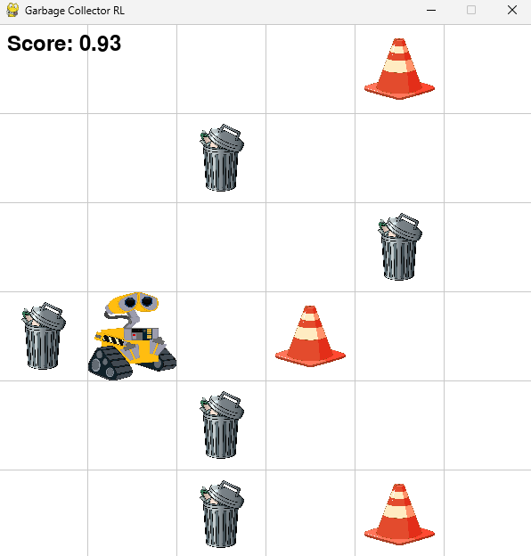

# Garbage Collector Robot RL

This project implements a reinforcement learning (RL) environment and agents for a garbage collector robot simulation. The robot navigates a grid, collects trash, and avoids obstacles while learning optimal strategies using Q-Learning and Deep Q-Networks (DQN).





## Features

- **Environment**: A grid-based simulation with customizable trash and obstacle counts.
- **Agents**: Includes Q-Learning and DQN agents for training and decision-making.
- **Rendering**: Smooth and realistic agent movement using `pygame`.
- **Reinforcement Learning**: Supports exploration vs. exploitation strategies and neural network-based Q-value approximation.

## Installation

1. Clone the repository:
   ```bash
   git clone https://github.com/ahmadkh1995/garbage_collector_robot_1.git
   cd garbage_collector_robot_1
   
2. Install dependencies:
   ```bash
   pip install -r requirements.txt


## Usage

* Run the Simulation
To start the simulation, execute the following command:
   ```bash
   python main.py

```
Train the Agent
Modify the agent configuration in agent/DQN_learning_agent.py or agent/Q_learning_agent.py and run the simulation to train the agent.  
Environment Customization
You can customize the environment in environment/garbage_collector_env.py:  
Number of obstacles: Set num_obstacles in the reset method.
Number of trash items: Set num_trashes in the reset method.
```


## Project structure

```
project/
├── main.py   # Entry point for the simulation.
├── environment/
│   └── garbage_collector_env.py  # Defines the RL environment.
├── agent/
│   ├── DQN_learning_agent.py  # Implements the DQN agent.
│   └── Q_learning_agent.py # Implements the Q-Learning agent.
├── assets/
│   └── icons/  # Contains icons for rendering the agent, trash, and obstacles.
└── requirements.txt  $ Contains requir3ed libraries to be installed 
```


## Requirements
    Python 3.8+
    numpy
    torch
    pygame
    gymnasium

## How It Works
    Environment: The robot moves in a grid, collecting trash and avoiding obstacles.
    Agents: RL agents learn optimal strategies using Q-Learning or DQN.
    Rendering: The simulation is visualized using pygame with smooth agent movement.
    Author: Ahmad Kheirandish - GitHub: ahmadkh1995